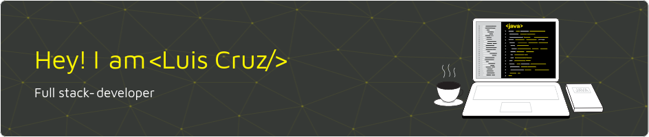

 
  <a href="https://github.com/LuisCarlosCruz">
  
  
   <h4>Sou estudante e desenvolvedor de software, busco contribuir com a minha formação conhecimento como desenvolvedor de software sob a supervisão e estímulo de uma empresa comprometida com a inovação e que faça diferença nas vidas das pessoas. Possuo foco em desenvolvimento com Javascript, ReactJs, NodeJs, Typescript, Docker, Mysql dentre outras tecnologias que uso para criar aplicações web.</h4>

<!--   -->

  
<!--   -->
  
<!--   -->
  
  
  
  
  
  
  
  
  
  
 
 <!--    -->

 
<!--   -->

##
<!-- https://icons8.com.br/ -->
 Icons by: <a href="https://icons8.com.br/">Icones</a>

